> 원문: [The Ultimate Guide To Proper Use Of Animation In UX](https://medium.com/user-experience-design-1/the-ultimate-guide-to-proper-use-of-animation-in-ux-10bd98614fa9)

&nbsp;

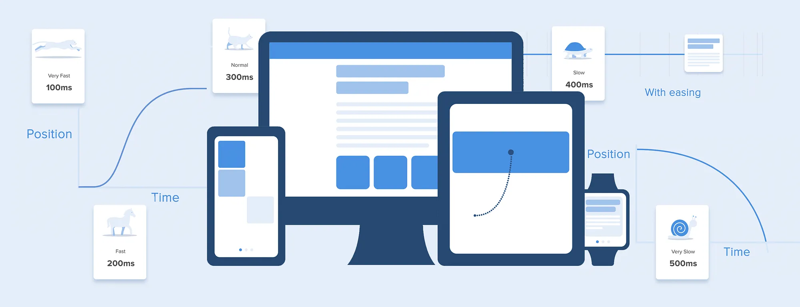

요즘에는 인터페이스 애니메이션으로 사람들을 감동시키거나 놀라게 하는 것이 어려워졌습니다.
애니메이션은 화면 간의 상호작용을 보여주고, 애플리케이션 사용 방법을 설명하거나 단순히 사용자의 주의를 끌기 위해 사용됩니다.
애니메이션에 관한 기사를 탐색하면서, 거의 모든 기사가 특정 사용 사례나 애니메이션에 대한 일반적인 사실만을 설명하고 있는 것을 발견했습니다.
그러나 인터페이스 애니메이션에 관한 모든 규칙을 명확하고 실용적으로 설명하는 기사는 찾지 못했습니다.
이 글에서는 새로운 내용을 제시하기보다는, 인터페이스 애니메이션을 시작하려는 다른 디자이너들이 추가 정보를 찾지 않고도 참고할 수 있도록 주요 원칙과 규칙을 한 곳에 모으려고 합니다.

## 애니메이션의 지속시간과 속도

요소가 상태나 위치를 변경할 때, 애니메이션의 지속 시간은 사용자가 변화를 인식할 수 있을 만큼 충분히 느려야 하지만, 동시에 기다림을 유발하지 않을 만큼 빨라야 합니다.

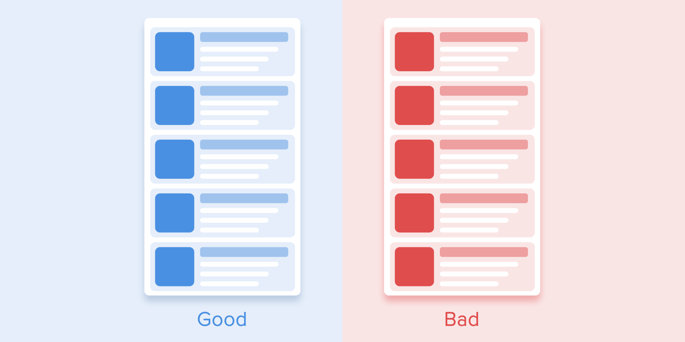

&nbsp;

[여러 연구](https://valhead.com/2016/05/05/how-fast-should-your-ui-animations-be/)에 따르면 인터페이스 애니메이션의 최적 속도는 200ms에서 500ms 사이입니다.
이 수치는 인간의 뇌의 특정 특성을 기반으로 한 것입니다. 100ms보다 짧은 애니메이션은 즉각적이며 인식되지 않을 것입니다.
반면, 1초보다 긴 애니메이션은 지연되는 느낌을 주어 사용자를 지루하게 만들 수 있습니다.

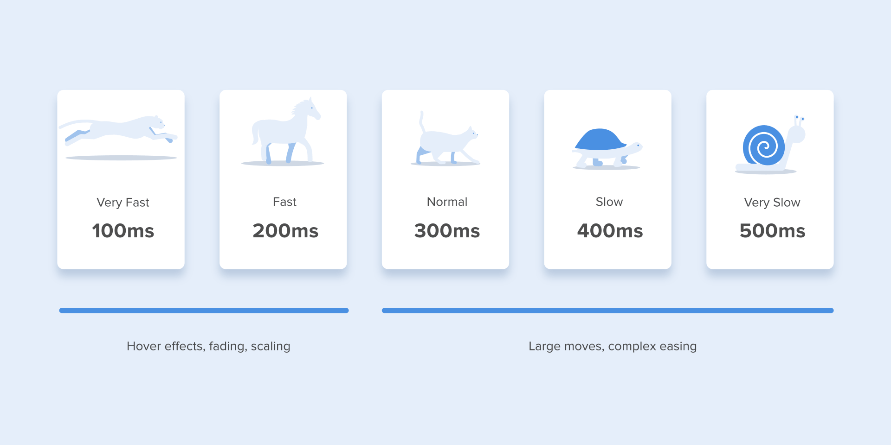

&nbsp;

[Material Design 가이드라인](https://m2.material.io/design/motion/speed.html#duration)은 모바일 기기에서 애니메이션의 지속 시간을 200-300ms로 제한할 것을 권장합니다.
태블릿의 경우, 지속 시간은 약 400-450ms로 30% 더 길어야 합니다. 그 이유는 화면이 더 크기 때문에 위치 변경 시 물체가 더 긴 경로를 이동하기 때문입니다.
마찬가지로, 작은 화면에서는 이동 거리가 짧기 때문에 웨어러블 기기에서의 지속 시간은 약 150-200ms로 30% 더 짧아야 합니다.

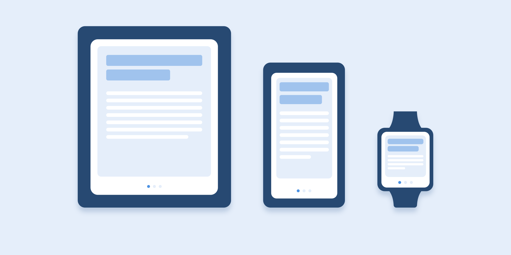

&nbsp;

웹 애니메이션은 다르게 다뤄집니다. 우리는 웹 페이지가 거의 즉시 열리는 것에 익숙해져 있기 때문에, 상태 간의 전환도 빠르기를 기대합니다.
따라서 웹 전환의 지속 시간은 150~200ms 사이로 모바일 기기보다 약 2배 짧아야 합니다. 그렇지 않으면 사용자는 컴퓨터가 멈추었거나 인터넷 연결에 문제가 있다고 생각할 수 있습니다.

하지만 웹사이트에서 장식을 위한 애니메이션을 만들거나 특정 요소에 사용자의 주의를 끌고자 할 때는 이 규칙을 잊어도 됩니다. 이러한 경우에는 애니메이션의 지속 시간을 더 길게 설정할 수 있습니다.

&nbsp;

플랫폼에 관계없이 애니메이션의 지속 시간은 이동 거리뿐만 아니라 물체의 크기에도 영향을 받아야 한다는 점을 기억해야 합니다.
작은 요소나 작은 변화를 포함하는 애니메이션은 더 빠르게 이동해야 합니다. 반면, 크고 복잡한 요소를 포함한 애니메이션은 조금 더 긴 시간이 소요될 때 더 좋게 보입니다.

같은 크기의 움직이는 물체들 중에서는 가장 짧은 거리를 이동한 물체가 먼저 멈춥니다.

작은 물체는 큰 물체에 비해 더 느리게 이동하는데, 이는 작은 물체가 더 큰 위치 변화량의 차이를 만들기 때문입니다.

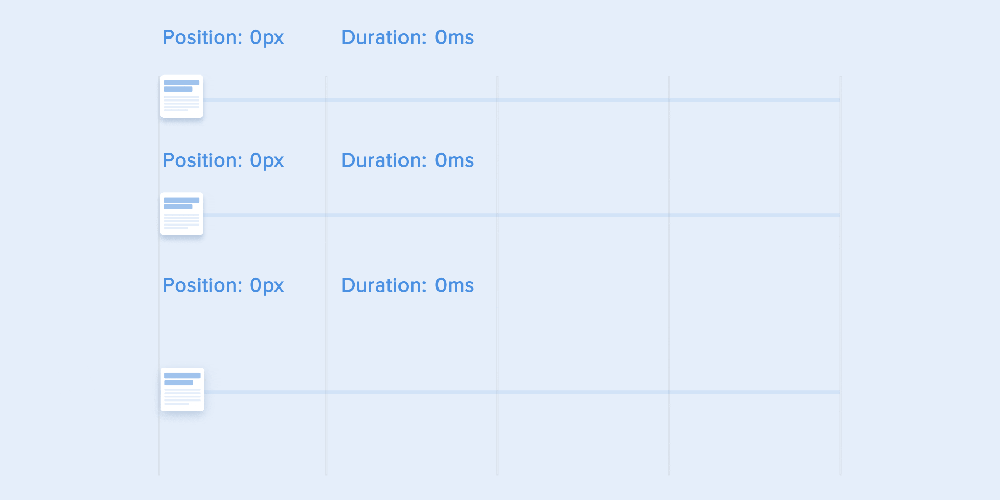

&nbsp;

물체가 충돌할 때, 물리법칙에 따라 충돌 에너지는 물체들 사이에 고르게 분산되어야 합니다. 따라서 튕김 효과는 제외하는 것이 좋습니다. 오직 특별한 경우에만 의미가 있을 때 사용하세요.

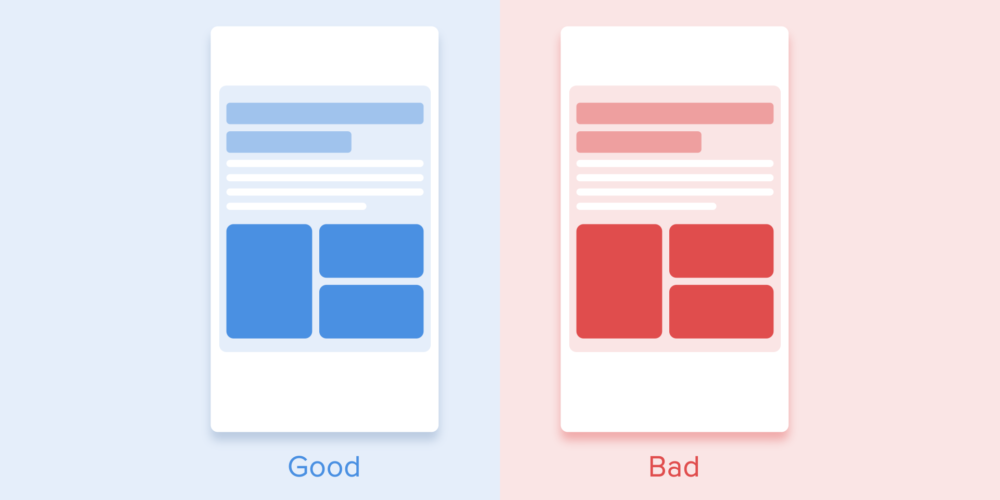

&nbsp;

물체의 움직임은 명확하고 선명해야 하므로 모션 블러는 사용하지 마세요.
최신 모바일 기기에서도 이 효과를 재현하기 어렵고, 인터페이스 애니메이션에서는 전혀 사용되지 않습니다.

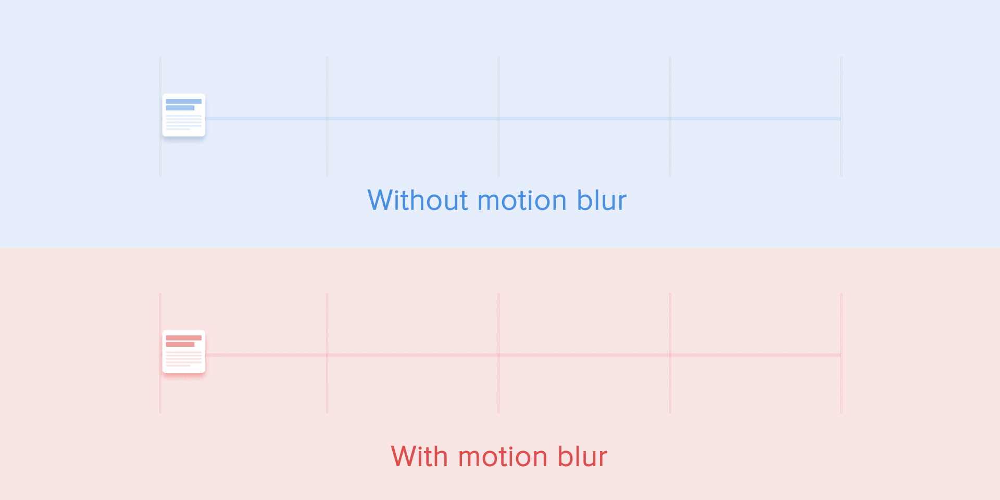

&nbsp;

목록 항목(뉴스 카드, 이메일 목록 등)은 나타날 때 아주 짧은 지연 시간을 가져야 합니다. 각 새 요소의 등장 시간은 20~25ms이어야 합니다.
요소가 너무 느리게 나타나면 사용자를 짜증나게 할 수 있습니다.

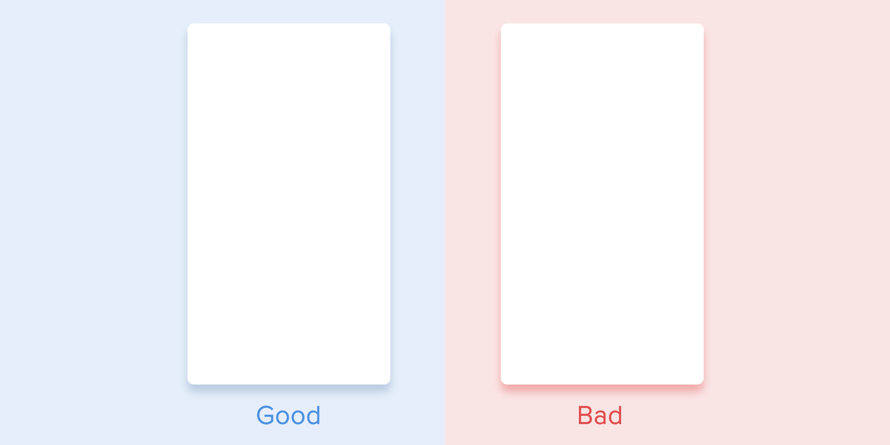

&nbsp;

## Easing

Easing은 물체의 움직임을 더 자연스럽게 만드는 데 도움을 줍니다.
이는 [애니메이션의 필수 원칙](https://vimeo.com/93206523) 중 하나로, 디즈니의 핵심 애니메이터인 올리 존스톤과 프랭크 토마스가 쓴 [**The Illusion of Life: Disney Animation**](https://www.wikiwand.com/en/Disney_Animation:_The_Illusion_of_Life) 책에서 자세히 설명되어 있습니다.

애니메이션이 기계적이고 인위적으로 보이지 않도록 하려면, 물체가 물리적 세계의 살아있는 모든 물체처럼 가속과 감속을 겪으며 움직여야 합니다.

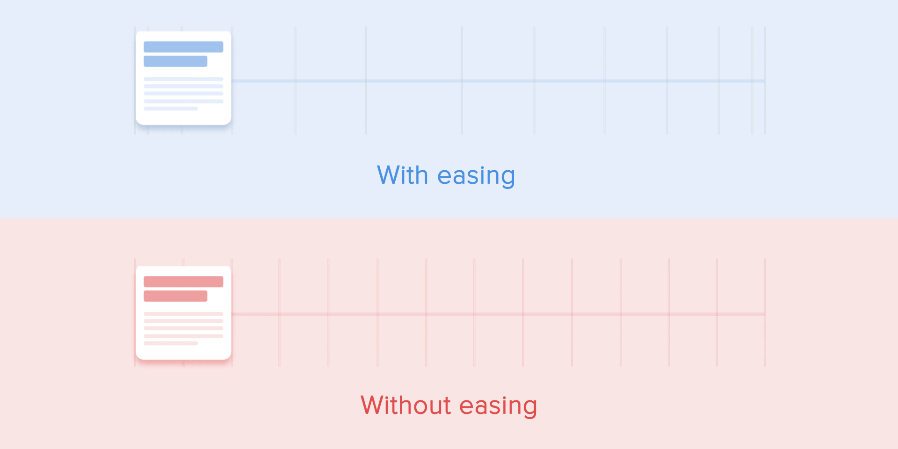

&nbsp;

### 선형 운동

물리적 힘의 영향을 받지 않는 물체는 선형적으로, 즉 일정한 속도로 움직입니다. 이 때문에 인간의 시각에는 매우 부자연스럽고 인위적으로 보입니다.

모든 애니메이션 프로그램에서는 애니메이션 곡선을 사용합니다. 곡선이 어떻게 읽히고 의미하는 바를 설명하겠습니다.
곡선은 물체의 위치 `(y 축)`가 동일한 시간 간격 `(x 축)` 동안 어떻게 변하는지를 나타냅니다. 현재 경우에는 이동이 선형적이므로, 물체는 같은 시간 동안 같은 거리를 이동합니다.

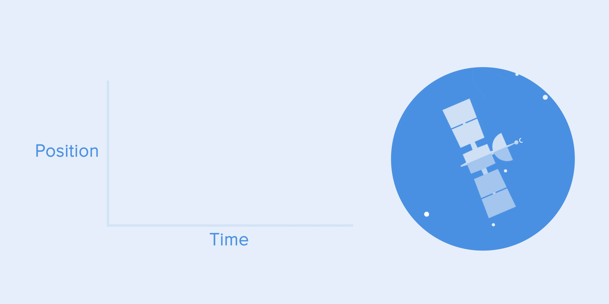

선형 운동은 예를 들어, 물체의 색상이나 투명도가 변경될 때만 사용될 수 있습니다. 일반적으로, 물체의 위치가 변경되지 않는 상태에서 사용할 수 있습니다.

&nbsp;

### Ease-In 또는 가속 곡선

곡선에서, 애니메이션의 시작 부분에서 물체의 위치가 천천히 변하고 속도가 점진적으로 증가하는 것을 볼 수 있습니다. 이는 물체가 특정한 가속도로 움직이고 있음을 의미합니다.

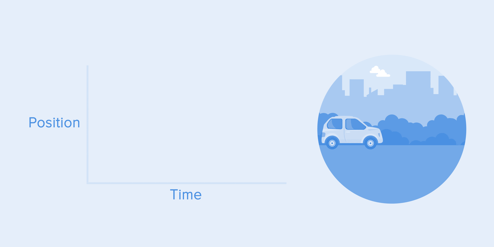

&nbsp;

이 곡선은 물체가 화면을 빠르게 떠날 때 사용해야 합니다. 예를 들어, 시스템 알림이나 인터페이스 카드가 해당됩니다.
하지만 이 곡선은 물체가 영원히 화면을 떠나서 다시 불러오거나 되돌릴 수 없는 경우에만 사용해야 합니다.

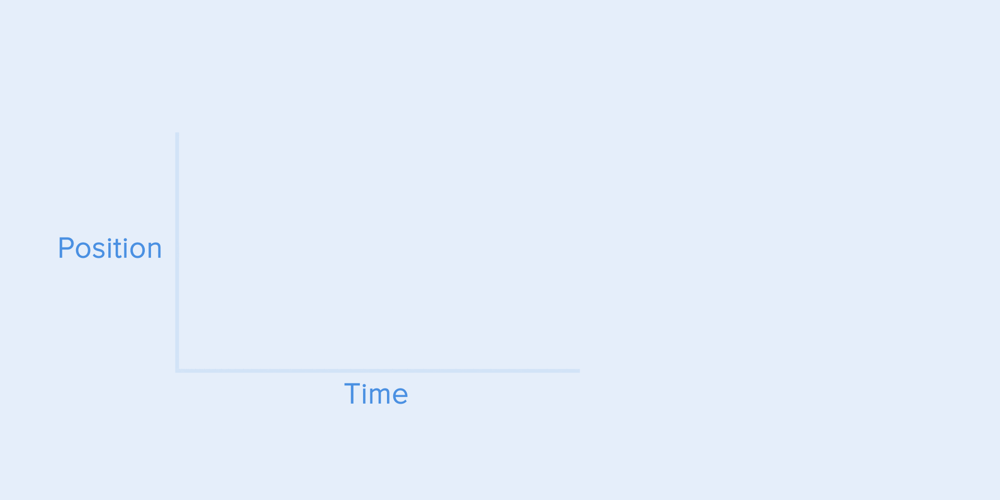

&nbsp;

애니메이션 곡선은 적절한 분위기를 표현하는 데 도움을 줍니다.
아래 예제에서 볼 수 있듯이, 모든 물체의 이동 지속 시간과 거리는 동일하지만, 곡선의 작은 변화만으로도 애니메이션의 분위기에 영향을 줄 수 있습니다.

또한, 곡선을 조정함으로써 물체를 실제 세계와 최대한 비슷하게 움직일 수 있습니다.

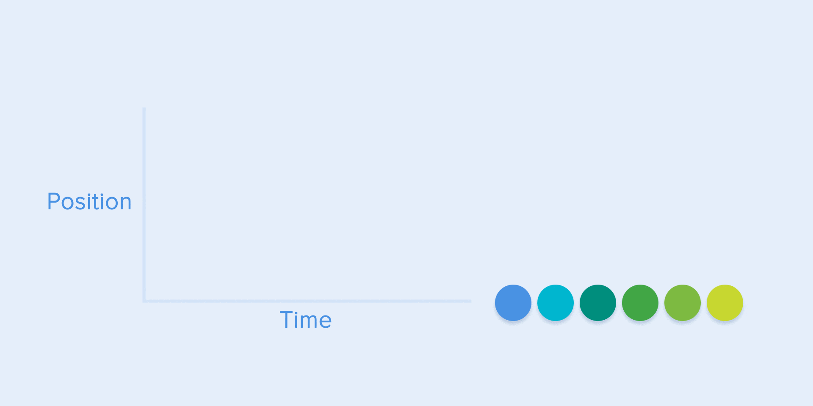

&nbsp;

### Ease-Out 또는 감속 곡선

Ease-Out 곡선은 Ease-In 곡선의 반대로, 물체는 처음에는 빠르게 긴 거리를 이동한 후 점점 속도를 줄여서 결국 멈추게 됩니다.

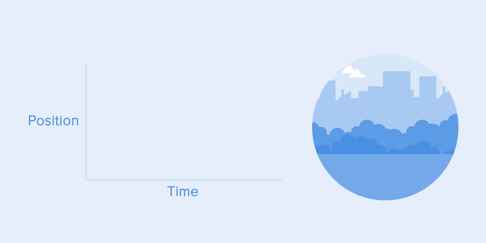

&nbsp;

이 유형의 곡선은 요소가 화면에 나타날 때 사용해야 합니다. 예를 들어, 요소가 화면 위로 빠르게 올라가다가 점점 속도를 줄여 완전히 멈추는 경우입니다.
또한, 화면 밖에서 나타나는 다양한 카드나 물체에도 적용할 수 있습니다.

&nbsp;

### Ease-in-out 또는 표준 곡선

이 곡선은 물체가 처음에는 속도를 높이다가 이후에 서서히 속도를 줄여서 정지하는 움직임을 제공합니다. 이러한 유형의 움직임은 인터페이스 애니메이션에서 가장 자주 사용됩니다.
애니메이션의 움직임 유형을 결정하기 어려울 때는 표준 곡선을 사용하세요.

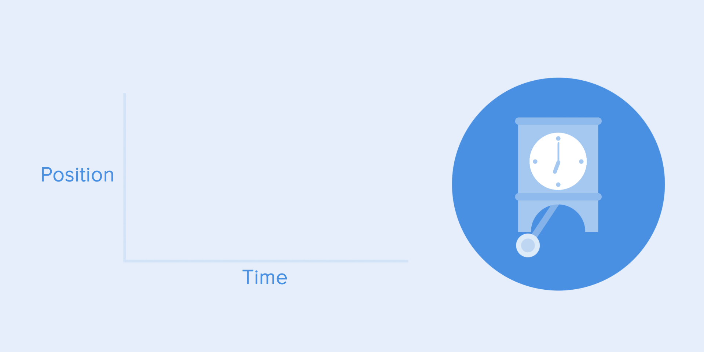

&nbsp;

[Material Design 가이드라인](https://m2.material.io/design/motion/customization.html#speed)에 따르면, 비대칭 곡선을 사용하는 것이 움직임을 더 자연스럽고 현실감 있게 만드는 데 좋습니다.
곡선의 끝부분이 시작 부분보다 더 강조되어야 하며, 이는 가속 기간이 감속 기간보다 짧아야 함을 의미합니다.
이렇게 하면 사용자가 요소의 마지막 움직임에 더 많은 주의를 기울이고, 따라서 새로운 상태에 더 집중할 수 있습니다.

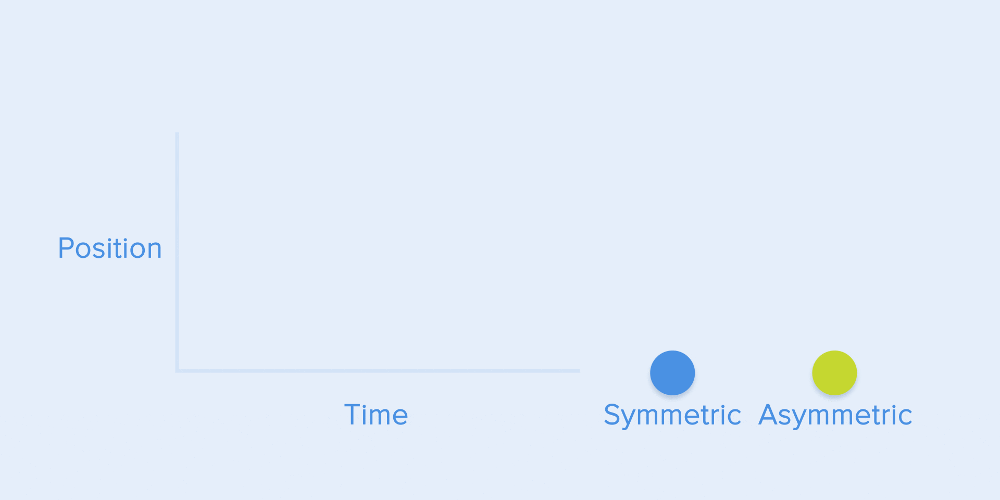

&nbsp;

Ease-in-out은 물체가 화면의 한 부분에서 다른 부분으로 이동할 때 사용됩니다. 이 경우, 애니메이션은 눈에 띄고 극적인 효과를 피합니다.

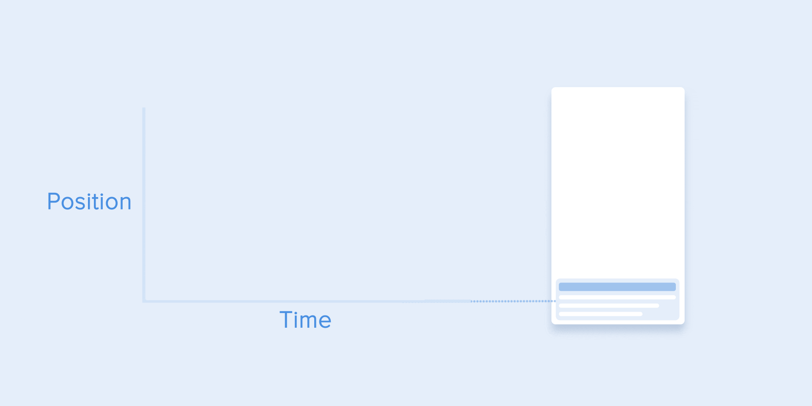

&nbsp;

요소가 화면에서 사라지지만 사용자가 언제든지 이전 위치로 복귀할 수 있어야 하는 경우, 동일한 움직임 유형을 사용해야 합니다. 이는 내비게이션 드로어 등 여러 경우에 적용됩니다.

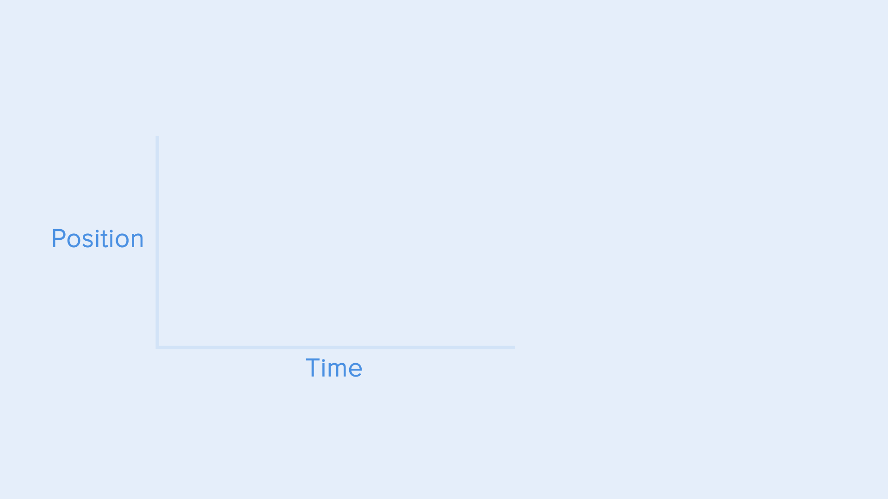

&nbsp;

이러한 예제들로부터 많은 초보자들이 간과하는 기본 규칙이 드러납니다 — 시작 애니메이션과 종료 애니메이션은 동일하지 않습니다.
내비게이션 드로어의 경우처럼, 드로어는 감속 곡선으로 나타나고, 표준 곡선으로 사라집니다.
게다가, [Google Material Design](https://material.io/design/motion/speed.html#duration)에 따르면, 물체의 나타나는 시간은 더 길어야 주목을 끌 수 있습니다.

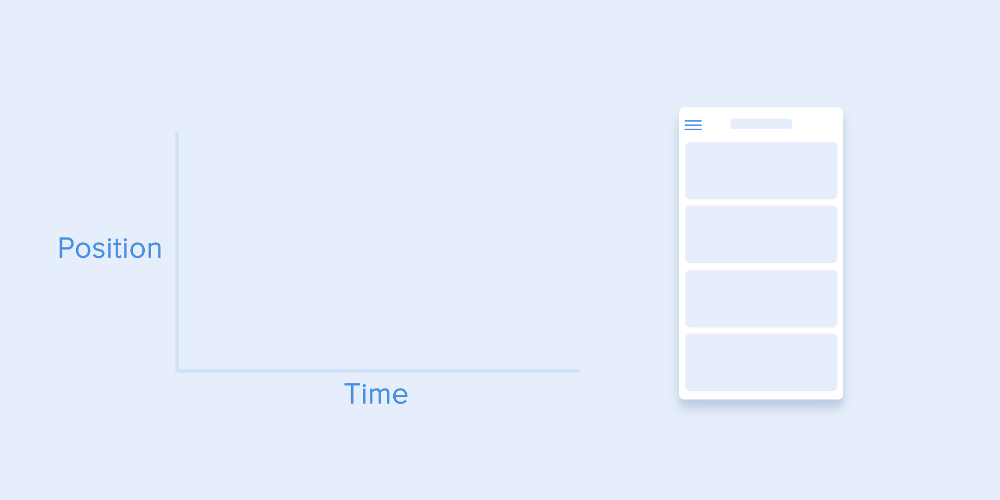

&nbsp;

함수 `cubic-bezier()`는 곡선을 설명하는 데 사용됩니다. 이 함수가 cubic이라 불리는 이유는 네 개의 점을 기반으로 하기 때문입니다.
그래프에서 첫 번째 점은 좌표 `0;0` (왼쪽 하단)이고, 마지막 점은 좌표 `1;1` (오른쪽 상단)으로 이미 정의되어 있습니다.

따라서 우리는 그래프에서 두 개의 점만 설명하면 됩니다. 이 두 점은 함수 `cubic-bezier()`의 네 개의 인자로 주어집니다:
첫 번째 두 개는 첫 번째 점의 `x` 및 `y` 좌표, 두 번째 두 개는 두 번째 점의 `x` 및 `y` 좌표입니다.

곡선 작업을 더 쉽게 하기 위해 [easings.net](https://easings.net/)과 [cubic-bezier.com](https://cubic-bezier.com/) 웹사이트를 사용하는 것을 추천합니다.
첫 번째 사이트는 가장 자주 사용되는 곡선 목록과 그 파라미터를 제공하여 프로토타입 도구에 복사할 수 있습니다.
두 번째 사이트는 다양한 곡선 파라미터를 실험하고 물체의 움직임을 즉시 확인할 수 있는 기능을 제공합니다.

&nbsp;

## 인터페이스 애니메이션에서의 조화로운 연출

발레 안무와 마찬가지로, 주요 아이디어는 한 상태에서 다른 상태로 전환할 때 사용자의 주의를 하나의 흐름으로 유도하는 것입니다.

조화로운 연출에는 동등한 상호작용과 종속적인 상호작용, 두 가지 유형이 있습니다.

&nbsp;

### 동등한 상호작용

동등한 상호작용은 모든 물체의 등장이 하나의 특정 규칙을 따르는 것을 의미합니다.

이 경우, 모든 카드의 나타남이 하나의 흐름으로 인식되어 사용자의 주의를 특정 방향, 즉 위에서 아래로 유도합니다.
순서를 지키지 않으면 사용자의 주의가 분산될 수 있습니다. 모든 요소가 동시에 나타나는 것도 좋지 않게 보일 수 있습니다.

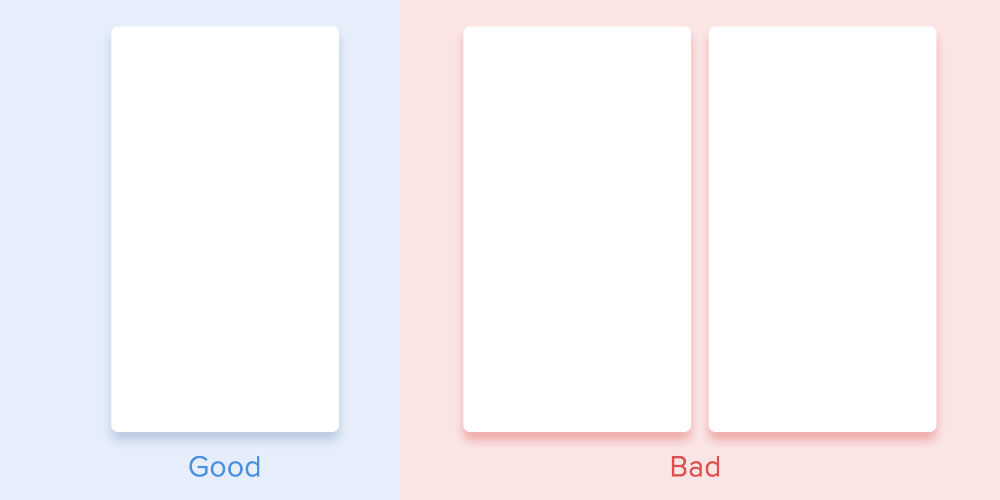

&nbsp;

표 형식의 보기에서는 상황이 조금 더 복잡합니다. 여기에서는 사용자의 초점을 대각선 방향으로 유도해야 하므로, 요소를 하나씩 표시하는 것은 좋은 아이디어가 아닙니다.
각 요소를 하나씩 드러내면 애니메이션이 지나치게 길어지고, 사용자의 주의가 지그재그로 분산되어 올바르지 않습니다.

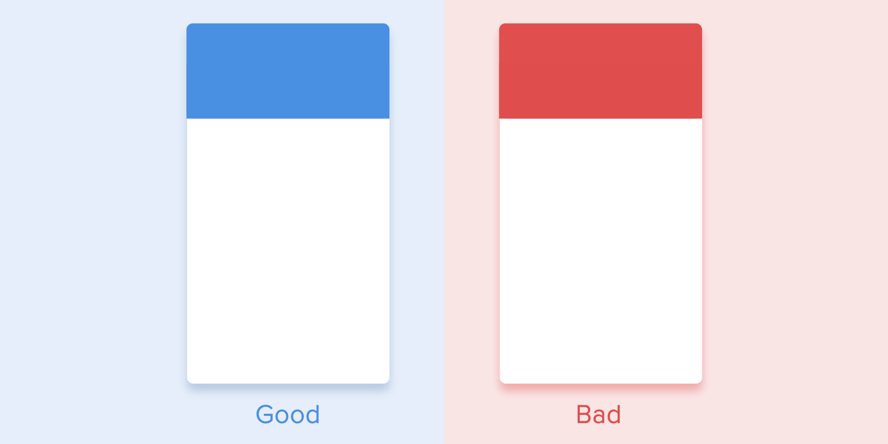

&nbsp;

### 종속적인 상호작용

종속적인 상호작용은 중앙에 위치한 주요 물체가 모든 사용자의 주의를 끌고, 나머지 요소들이 이 주요 물체에 종속되는 것을 의미합니다.
이 유형의 애니메이션은 질서감을 주고 주요 콘텐츠에 더 많은 주의를 끌게 합니다.

다른 경우에는 사용자가 따라야 할 물체를 알기 어려워 주의가 분산될 수 있습니다.
따라서 여러 요소를 애니메이션으로 표현하고 싶다면, 이들의 이동 순서를 명확히 정의하고 한 번에 최소한의 물체만 애니메이션으로 처리하는 것이 필요합니다.

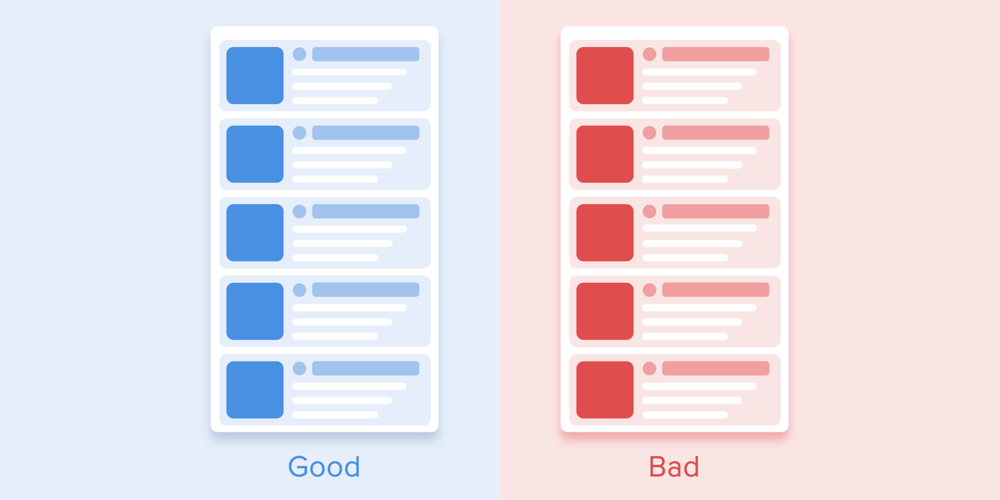

&nbsp;

[Material Design](https://material.io/design/motion/customization.html#movement)에 따르면, 이동하는 물체가 크기를 불균형적으로 변형할 때는 직선이 아니라 곡선을 따라 이동해야 합니다.
이는 움직임을 더 자연스럽게 만드는 데 도움이 됩니다. 여기서 "불균형적으로"란 물체의 높이와 너비 변화가 비대칭적으로, 즉 서로 다른 속도로 이루어질 때를 의미합니다. (예시: 정사각형 카드가 직사각형으로 변하는 경우)

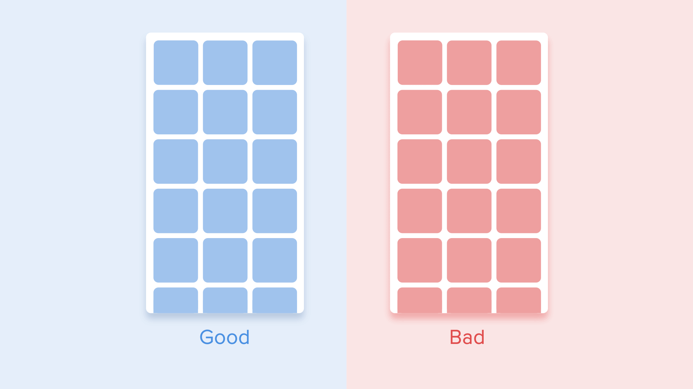

&nbsp;

물체의 크기가 비례적으로 변경될 때는 직선을 따라 움직입니다. 이러한 움직임의 구현이 훨씬 간단한 이유로, 불균형적 곡선 움직임 규칙이 자주 간과됩니다.
실제 애플리케이션의 예를 보면, 직선 움직임이 지배적으로 많다는 것을 알 수 있습니다.

&nbsp;

곡선을 따라 이동하는 방법에는 두 가지가 있습니다: 첫 번째는 **Vertical out**으로, 물체가 수평으로 이동을 시작하여 수직으로 끝나는 방법입니다.
두 번째는 **Horizontal out**으로, 물체가 수직으로 이동을 시작하여 수평으로 끝나는 방법입니다.

물체의 곡선 이동 경로는 스크롤 인터페이스의 주요 축과 일치해야 합니다.
예를 들어, 다음 이미지를 보면 인터페이스를 위아래로 스크롤할 수 있고, 카드는 그에 따라 처음에는 오른쪽으로 이동하다가 나중에 아래로 이동하는 **Vertical out** 방식으로 펼쳐집니다.
반대의 경우에는 역으로 처음에 위로 상승하다가 나중에 수평으로 이동합니다.

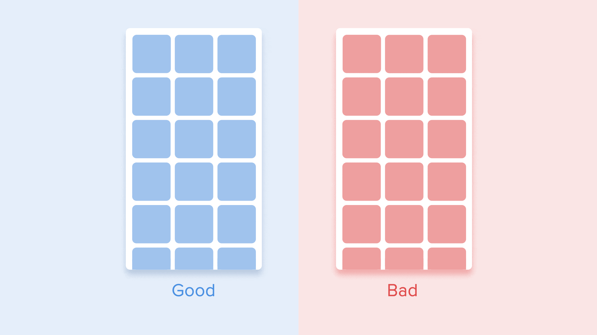

&nbsp;

이동하는 물체의 경로가 서로 교차할 경우, 물체들은 서로를 통과할 수 없습니다. 물체들은 다른 물체의 이동을 위해 충분한 공간을 확보해야 하므로 속도를 감속하거나 가속해야 합니다.
또 다른 방법은 다른 물체를 밀어내는 것입니다. 그 이유는 인터페이스의 모든 물체가 동일한 평면 위에 있다고 가정하기 때문입니다.

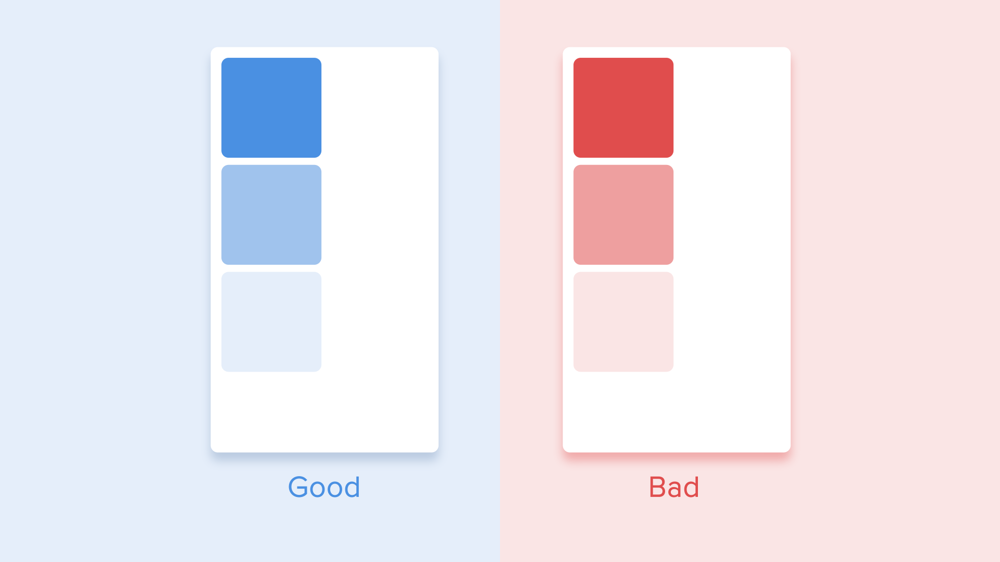

&nbsp;

다른 경우에는 이동하는 물체가 다른 물체 위로 올라갈 수 있지만, 여전히 다른 물체를 통과하거나 합쳐지는 일은 없어야 합니다.
그 이유는 인터페이스의 요소들이 물리 법칙에 따라 행동한다고 가정하기 때문이며, 실제 세계의 고체 물체는 그렇게 할 수 없기 때문입니다.

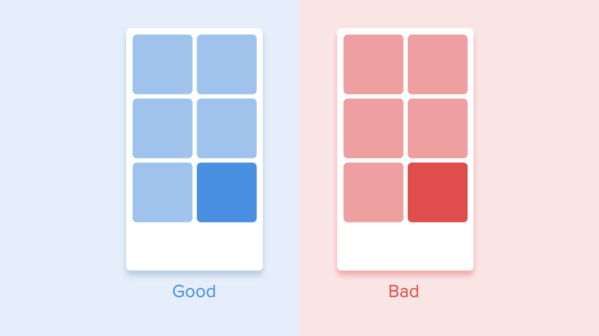

&nbsp;

## 결론

따라서, 위에서 언급한 모든 규칙과 원칙을 종합하면, 인터페이스의 애니메이션은 마찰, 가속도 등 물리 세계에서 우리가 아는 움직임을 반영해야 합니다.
실제 세계의 물체의 움직임을 모방함으로써, 사용자가 인터페이스에서 무엇을 기대해야 하는지 이해할 수 있는 일관된 순서를 만들 수 있습니다.

애니메이션이 올바르게 구축되면 사용자의 목표를 방해하지 않고 자연스럽게 진행됩니다. 그렇지 않다면 애니메이션을 부드럽게 조정하거나 아예 제거해야 합니다.
즉, 애니메이션은 사용자를 지체시키거나 작업 수행을 방해해서는 안 됩니다.

하지만 애니메이션은 과학보다는 예술에 가까우므로, 실험하고 사용자에게 테스트해 보는 것이 좋습니다.

&nbsp;

### 참고 및 추가 자료

- [Discover the expanded Material Design motion guidelines](https://www.youtube.com/watch?v=6p3i6H2oGa0)
- [Школа мобильного дизайна — Анимация в интерфейсах](https://www.youtube.com/watch?v=DTLF-Mpv534)
- [Designing Interface Animation: Meaningful Motion for User Experience](https://books.google.de/books?id=Ano3DwAAQBAJ&printsec=frontcover&dq=editions%3AISBN1933820322&hl=uk#v=onepage&q=editions%3AISBN1933820322&f=false)
- [Creating Usability with Motion: The UX in Motion Manifesto](https://medium.com/ux-in-motion/creating-usability-with-motion-the-ux-in-motion-manifesto-a87a4584ddc)
- [Jedi Principles of UI Animation](https://medium.com/@adaptivepath/jedi-principles-of-ui-animation-2b88423b1dac)
- [Getting started with UI motion design](https://medium.com/this-also/getting-started-with-ui-motion-design-d82d4a625801)
