최근에 시맨틱 태그에 대한 조사가 필요해서 레퍼런스로 무신사를 들여다보다가 흥미로운 것을 발견했습니다.
개발자 도구를 통해서 태그들을 살펴보고 있는데, 상품 목록을 표시하는 요소가 스크롤을 내리면 업데이트되는 것이었습니다.

&nbsp;


&nbsp;

스크롤을 내리면 추가적인 정보들이 따라 붙는 무한 스크롤과는 또 다른 기술인 것 같아서 신기했습니다.
더 자세히 알고 싶어서 태그에 포함되어있던 `data-testId` 속성의 **virtuoso-items-list**를 키워드로
자료 조사를 시작했고, **목록 가상화**라는 기술을 새롭게 알게 되었습니다.

## 목록 가상화란?

목록 가상화는 사용자에게 표시되는 것만 렌더링하는 개념으로, **윈도잉**이라고도 합니다.

행이 여러 개 포함된 큰 테이블이나 목록을 표시해야할 때, 이러한 목록의 모든 항목을 로드하면
로딩이 지연되거나 렌더링 성능이 저하되는 등 성능에 상당한 영향을 미칠 수 있습니다.
이럴 때, 목록 가상화를 적용하면 DOM 조작을 최소화할 수 있어 성능 향상을 기대할 수 있습니다.

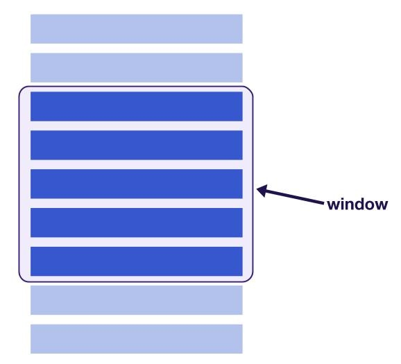

처음에 렌더링되는 요소의 수는 전체 목록의 매우 적은 하위 집합으로, 계속 스크롤할 때 표시되는 콘텐츠의 창(window)이 이동합니다.
그렇기 때문에 매우 많은 수의 데이터를 한번에 렌더링하는데 필요한 비용을 줄일 수 있고, 렌더링 성능과 스크롤 성능을 향상시킬 수 있습니다.

창을 나가는 DOM 노드는 재활용되거나 사용자가 목록을 아래로 스크롤할 때 새로운 요소로 즉시 대체됩니다.
이를 통해 창의 크기에 따라 렌더링된 모든 요소의 수가 유지됩니다.

목록 가상화에 대해 알아보면서 전에 진행했던 [tech-orbit](https://tech-orbit.wontory.dev/)이라는 프로젝트가 생각났습니다.
README 프로필을 꾸밀 수 있는 Animated SVG 프로젝트인데, Simple Icons에서 받아오는 아이콘 수가 매우 많았고
이로 인한 이슈들이 있었어서 목록 가상화를 통해 해결해보기로 했습니다.

## 목록 가상화를 적용하기 전

### 1. 렌더링 관점에서의 문제점

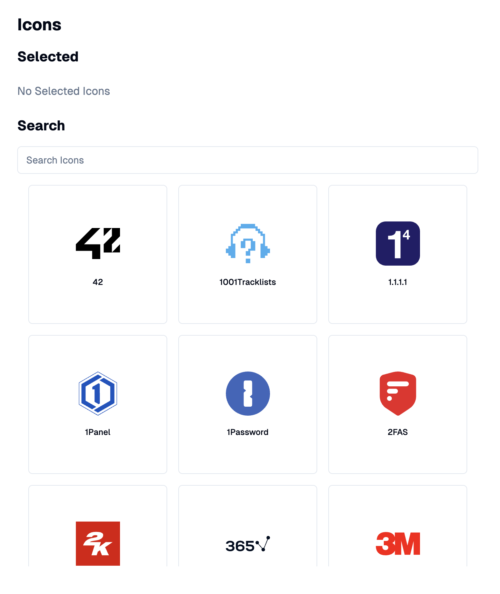

&nbsp;

기존 프로젝트의 아이콘 선택 영역입니다. 겉보기엔 평범해 보이지만 이 목록은 아래와 같이 렌더링되고 있었습니다.

&nbsp;

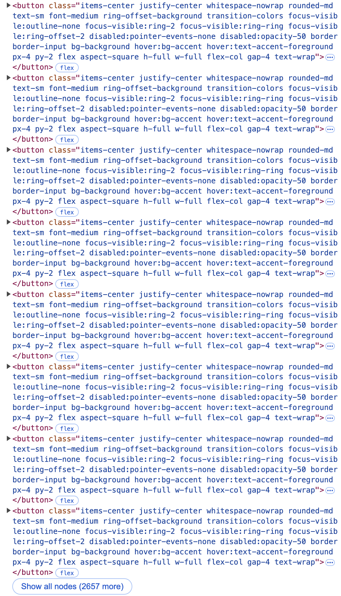

&nbsp;

아이콘 목록은 [simple-icons](https://simpleicons.org/)라는 패키지를 통해서 받아오는데,
개발자 도구의 한 면을 훨씬 넘게 가득 채우고도 2657개의 버튼 요소들이 추가로 존재하고 있었습니다.

이렇게 많은 DOM Elements를 렌더링하려면 브라우저에게 꽤나 부담스러울 수 있을 것 같다는 생각을 했고,
체감상으로도 첫 화면을 보기까지의 시간이 꽤나 오래 걸리는 것을 느낄 수 있었습니다.

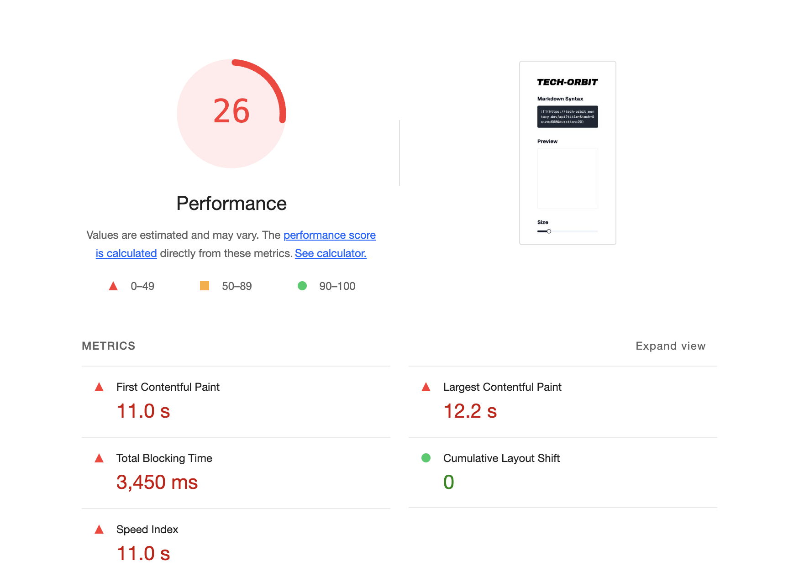
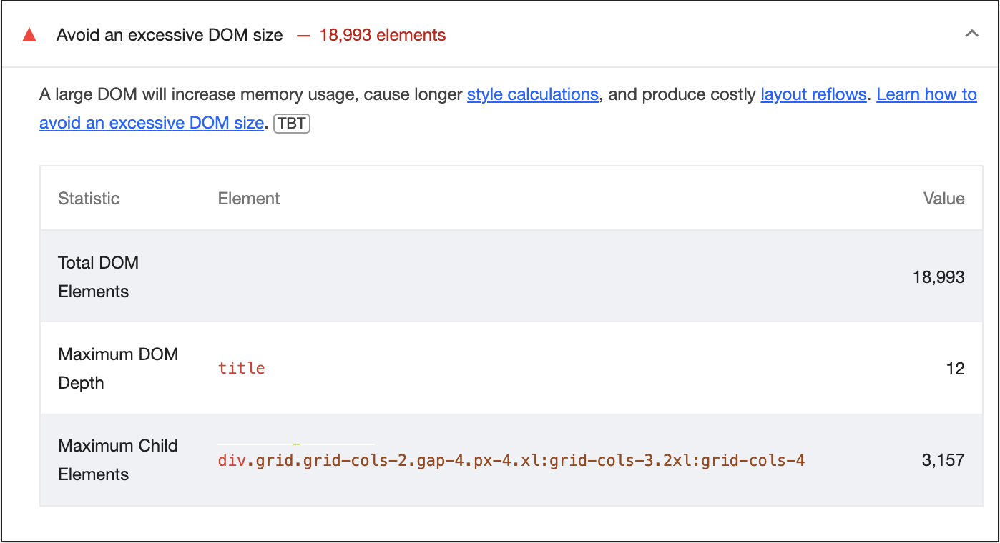

실제로 Chrome의 Lighthouse를 통해서 분석해봤을 때에도, 처참한 성능 지표와 함께
아이콘 목록 grid 부분의 DOM Size가 너무 크다는 진단을 받을 수 있었습니다.

&nbsp;

### 2. 사용자 경험 관점에서의 문제점

로딩이 조금 느리긴 했어도 참아줄 수 있는 수준이었다면, 사용자 경험 관점에서 매우 답답한 상황이 하나 있었습니다.

바로 검색 기능이었는데요.

원하는 아이콘을 검색하면 하단 목록에서 필터된 결과물이 보이는 기능입니다.

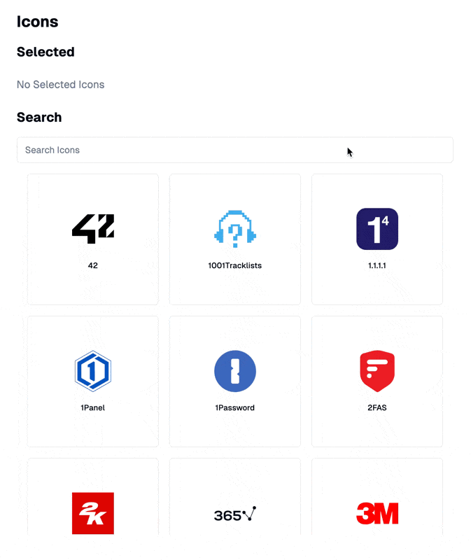

필터된 아이콘 수의 변화가 작은 경우에는 크게 이상함을 느낄 수 없지만,
검색했던 키워드를 지우고 새로 검색하는 등으로 인해 아이콘 수가 급격하게 늘어나면
리렌더링할 때 발생하는 부담때문에 어플리케이션 전체가 잠깐 멈추는 문제가 있었습니다.

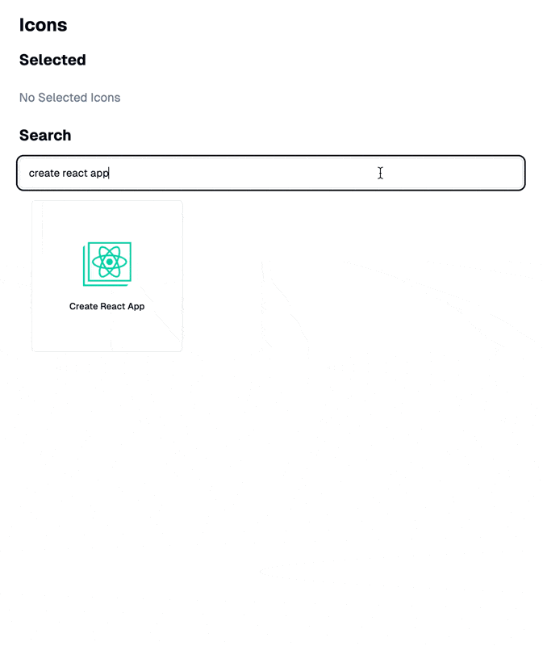

&nbsp;

## TanStack Virtual을 이용한 목록 가상화

위의 문제점들을 목록 가상화를 통해 해결해보겠습니다!

목록 가상화를 직접 구현할 수도 있고 라이브러리를 사용할 수도 있지만, 처음 접하는 기술이다 보니 비교적 접근하기 쉬운 라이브러리를 사용해보기로 했습니다.

이 라이브러리들도 다양한 종류가 있는데,
대표적으로 [react-virtualized](https://bvaughn.github.io/react-virtualized/),
react-virtualized를 경량화한 [react-window](https://react-window.vercel.app/),
무신사에서 사용하고 있는 [react-virtuoso](https://virtuoso.dev/),
마지막으로 [@tanstack/react-virtual](https://tanstack.com/virtual/)이 있습니다.

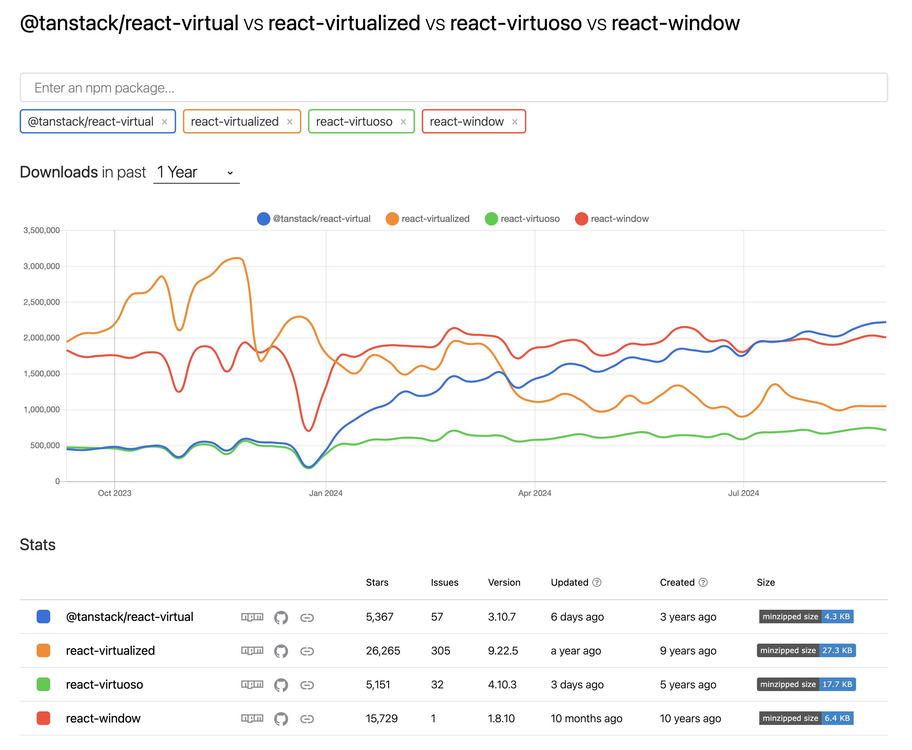

[npm trends](https://npmtrends.com/@tanstack/react-virtual-vs-react-virtualized-vs-react-virtuoso-vs-react-window)를 통해서 살펴보면,
글을 작성하고 있는 시점을 기준으로 **@tanstack/react-virtual**이 다운로드 수도 가장 많고 용량도 작으면서, 최근까지 잘 업데이트되고 있는 것을 확인할 수 있었습니다.

TanStack Virtual의 대표적인 특징은 다음과 같습니다.

- 경량 라이브러리
- 트리쉐이킹 지원
- Headless
- 가로/세로, 그리드 등 다양한 레이아웃 지원 등

&nbsp;

### 1. TanStack Virtual 설치

TanStack Virtual은 virtual-core와 이를 각 환경에 맞게 래핑한 어댑터 패키지들로 구성되어있습니다.
**tech-orbit**은 Next.js 프로젝트이므로 react 어댑터 패키지를 설치해주겠습니다.

```bash
bun add @tanstack/react-virtual
```

&nbsp;

### 2. 아이콘 목록 레이아웃 변경

아이콘 목록 레이아웃을 그리드에서 일반적인 리스트 형태로 변경해주겠습니다.
이유는 글 마지막의 아쉬운 점에서 후술하겠습니다.

우선 아이콘을 추가하는 버튼 스타일을 일반적인 리스트 형태에 맞춰 가로로 길게 스타일을 수정해주었습니다.

```tsx title="Before" showLineNumbers collapse={1-14, 28-31}
"use client";

import { useSetAtom } from "jotai";

import { Button } from "@/components/ui/button";
import { selectedIconsAtom } from "@/atoms/selected-icons";
import type { IconType } from "@/types/icons";

function AddIconButton({ icon }: { icon: IconType }) {
  const setSelectedIcons = useSetAtom(selectedIconsAtom);

  const handleClick = () => setSelectedIcons((prev) => [...prev, icon.title]);

  return (
    <Button
      variant="outline"
      className="flex aspect-square h-full w-full flex-col gap-4 text-wrap"
      onClick={handleClick}
    >
      <div
        dangerouslySetInnerHTML={{
          __html: icon.svg.replace("<svg", `<svg fill="#${icon.hex}"`),
        }}
        className="h-16 w-16"
      />
      <span className="text-xs">{icon.title}</span>
    </Button>
  );
}

export { AddIconButton };
```

```tsx title="After" showLineNumbers collapse={1-14, 28-31}
"use client";

import { useSetAtom } from "jotai";

import { Button } from "@/components/ui/button";
import { selectedIconsAtom } from "@/atoms/selected-icons";
import type { IconType } from "@/types/icons";

function AddIconButton({ icon }: { icon: IconType }) {
  const setSelectedIcons = useSetAtom(selectedIconsAtom);

  const handleClick = () => setSelectedIcons((prev) => [...prev, icon.title]);

  return (
    <Button
      variant="outline"
      className="size-full justify-normal gap-8 text-wrap p-4 px-6"
      onClick={handleClick}
    >
      <div
        dangerouslySetInnerHTML={{
          __html: icon.svg.replace("<svg", `<svg fill="#${icon.hex}"`),
        }}
        className="size-8"
      />
      <span className="text-base">{icon.title}</span>
    </Button>
  );
}

export { AddIconButton };
```

&nbsp;

### 3. Virtualizer 적용

TanStack Virtual의 중심에는 **Virtualizer**가 있습니다.

Virtualizer는 가로 또는 세로 축을 기준으로 할 수 있습니다. 그리고 이 두 축을 결합하여 그리드처럼 가상화를 할 수도 있습니다.
저는 기본값인 세로를 기준으로 가상화를 해보도록 하겠습니다.

먼저 **스크롤이 가능한 Wrapper Element**를 추가해줍니다. 이 요소는 목록 가상화에서 **창**(window)과 같은 역할을 합니다.
창은 실질적으로 보여질(렌더링 될) 영역으로 그 크기가 명확해야 하고, 창 내부에는 각 item들이 정확한 위치에(`position: absolute`) 렌더링될 것입니다.
Tailwind CSS를 사용해서 창의 `height`를 제한해주고, `ref`를 통해 다음에 정의할 Virtualizer가 해당 요소를 참조할 수 있도록 해주겠습니다.

```tsx title="icons-list.tsx" showLineNumbers
"use client";

import { useRef } from "react";

import { icons } from "@/assets/icons";

function IconsList({ searchValue }: { searchValue: string }) {
  const parentRef = useRef<HTMLDivElement>(null);

  const filteredIcons = Object.entries(icons).filter((icon) =>
    icon[1].title.toLowerCase().includes(searchValue)
  );

  return (
    <div
      className="max-h-[calc(100dvh-512px)] min-h-96 overflow-auto"
      ref={parentRef}
    ></div>
  );
}

export { IconsList };
```

&nbsp;

그 다음으로 Virtualizer를 정의해주도록 하겠습니다.

**@tanstack/react-virtual**은 React 환경에서 Virtualizer 정의를 위한 `useVirtualizer` 훅을 제공하고 있습니다.

[Virtualizer](https://tanstack.com/virtual/latest/docs/api/virtualizer)는 `count`, `getScrollElement`, `estimateSize`를 필수 옵션으로 받는데,
각 옵션은 다음을 의미합니다.

- `count`: 가상화할 요소의 총 수
- `getScrollElement`: 스크롤할 수 있는 요소를 반환하는 함수
- `estimateSize`: 가상화할 요소의 크기(단위: px), 동적으로 계산 가능

`count`로는 전체 `filteredIcons`의 길이를, `getScrollElement`에는 위에서 정의했던 `Ref`를 반환하는 함수를, `estimateSize`로는 수정한 `AddIconButton` 컴포넌트의 높이를 각각 입력해주었습니다.

그리고 optional 옵션으로 약간의 gap을 추가해주었습니다.

```tsx title="icons-list.tsx" showLineNumbers
"use client";

import { useRef } from "react";
import { useVirtualizer } from "@tanstack/react-virtual";

import { icons } from "@/assets/icons";

function IconsList({ searchValue }: { searchValue: string }) {
  const parentRef = useRef<HTMLDivElement>(null);

  const filteredIcons = Object.entries(icons).filter((icon) =>
    icon[1].title.toLowerCase().includes(searchValue)
  );

  const rowVirtualizer = useVirtualizer({
    count: filteredIcons.length,
    getScrollElement: () => parentRef.current,
    estimateSize: () => 66,
    gap: 16,
  });

  return (
    <div
      className="max-h-[calc(100dvh-512px)] min-h-96 overflow-auto"
      ref={parentRef}
    ></div>
  );
}

export { IconsList };
```

&nbsp;

창 내부에는 **전체 목록 item들이 들어갈** 또 다른 거대한 Wrapper를 추가해주겠습니다.
Tailwind CSS로 이 요소의 높이를 지정하면 Virtualizer에 의해 Inline CSS로 Overwrite 되면서 우선순위에서 밀리기 때문에,
Inline CSS를 사용해서 전체 높이를 지정해주도록 하겠습니다. (Virtualizer의 `getTotalSize` 사용)

```tsx title="icons-list.tsx" showLineNumbers collapse={1-22, 34-37}
"use client";

import { useRef } from "react";
import { useVirtualizer } from "@tanstack/react-virtual";

import { icons } from "@/assets/icons";

function IconsList({ searchValue }: { searchValue: string }) {
  const parentRef = useRef<HTMLDivElement>(null);

  const filteredIcons = Object.entries(icons).filter((icon) =>
    icon[1].title.toLowerCase().includes(searchValue)
  );

  const rowVirtualizer = useVirtualizer({
    count: filteredIcons.length,
    getScrollElement: () => parentRef.current,
    estimateSize: () => 66,
    gap: 16,
  });

  return (
    <div
      className="max-h-[calc(100dvh-512px)] min-h-96 overflow-auto"
      ref={parentRef}
    >
      <div
        className="relative w-full"
        style={{
          height: `${rowVirtualizer.getTotalSize()}px`,
        }}
      ></div>
    </div>
  );
}

export { IconsList };
```

&nbsp;

마지막으로 안쪽에 Virtualizer로부터 받은 item들을 추가해주면 되는데, `getVirtualItems`를 통해서 받아올 수 있습니다.
Virtualizer를 통해서 받은 item들은 `index`와 `key`, `size`, `start` 등의 값들을 가지고 있습니다.
Virtualizer는 이 값들을 활용해서 스크롤 위치 변화를 감지해 렌더링할 요소와 렌더링하지 않을 요소를 구분하고, React와 잘 통합되도록 도와줍니다.

```tsx title="icons-list.tsx" showLineNumbers
"use client";

import { useRef } from "react";
import { useVirtualizer } from "@tanstack/react-virtual";

import { AddIconButton } from "@/components/add-icon-button";
import { icons } from "@/assets/icons";

function IconsList({ searchValue }: { searchValue: string }) {
  const parentRef = useRef<HTMLDivElement>(null);

  const filteredIcons = Object.entries(icons).filter((icon) =>
    icon[1].title.toLowerCase().includes(searchValue)
  );

  const rowVirtualizer = useVirtualizer({
    count: filteredIcons.length,
    getScrollElement: () => parentRef.current,
    estimateSize: () => 66,
    gap: 16,
  });

  return (
    <div
      className="max-h-[calc(100dvh-512px)] min-h-96 overflow-auto"
      ref={parentRef}
    >
      <div
        className="relative w-full"
        style={{
          height: `${rowVirtualizer.getTotalSize()}px`,
        }}
      >
        {rowVirtualizer.getVirtualItems().map((virtualRow) => (
          <div
            key={virtualRow.key}
            className="absolute left-0 top-0 w-full"
            style={{
              height: `${virtualRow.size}px`,
              transform: `translateY(${virtualRow.start}px)`,
            }}
          >
            <AddIconButton icon={filteredIcons[virtualRow.index][1]} />
          </div>
        ))}
      </div>
    </div>
  );
}

export { IconsList };
```

&nbsp;

## 목록 가상화를 적용한 후

목록 가상화를 적용한 이후의 아이콘 목록 UI입니다.

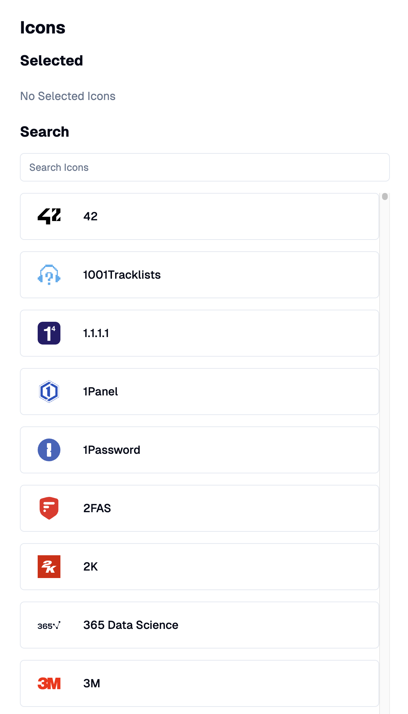

&nbsp;

개발자 도구를 열고 확인해보면, 기존에 3000개가 넘어갔던 버튼들 대신 화면 높이에 따라 몇 개의 버튼들만 렌더링되고 있는 것을 알 수 있습니다.
그리고 스크롤을 통해 Virtualizer가 item들을 잘 업데이트하고 있는 것도 확인해볼 수 있었습니다.


&nbsp;

그리고 눈에 띄는 개선점은 로딩 속도 개선이었는데, 따로 성능을 진단해보지 않아도 체감이 가능할 수준이었습니다.
Chrome 개발자 도구의 Performance 탭에서 확인해보면 아래 사진과 같은데,

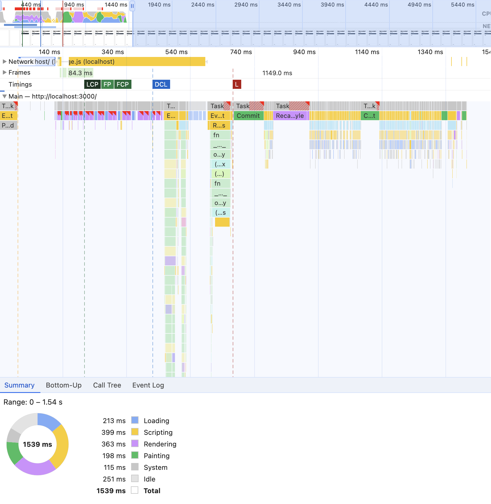
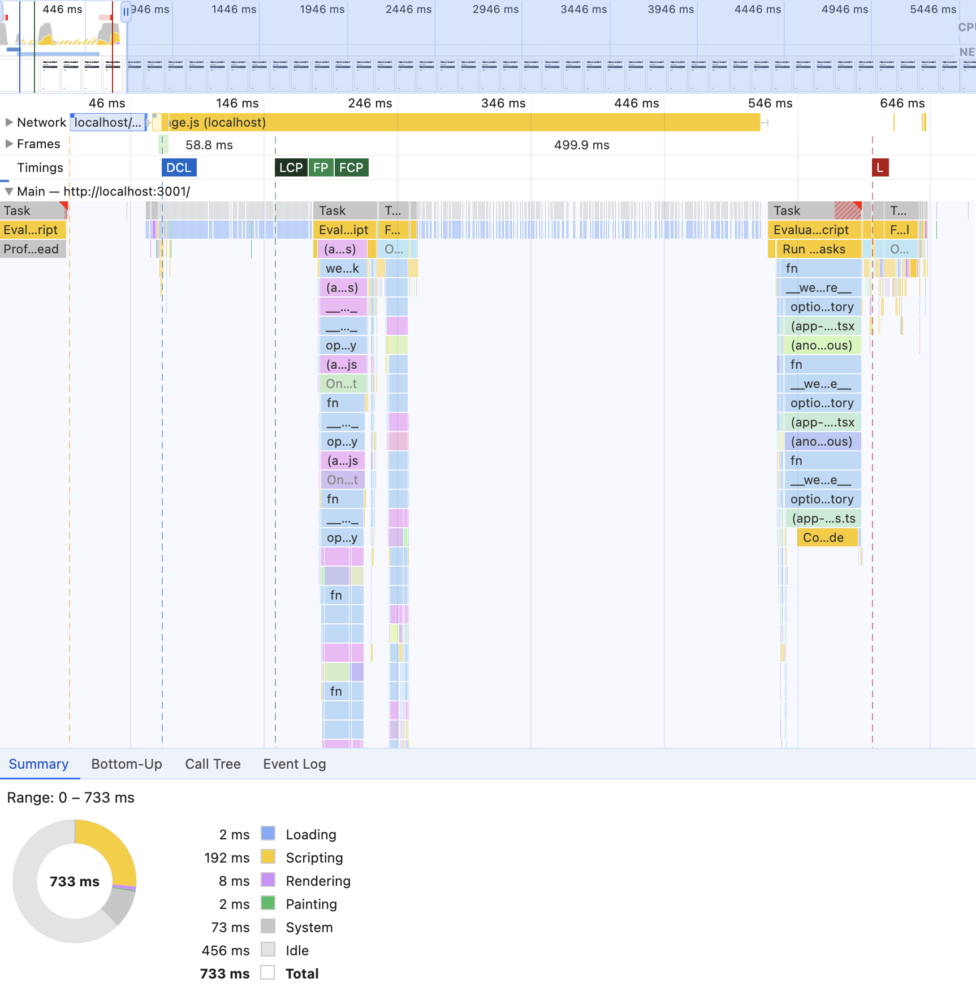

Summary의 Total을 들여다보면, 이전 1539ms에서 목록 가상화를 적용한 이후 약 1/2 수준인 733ms로 눈에 띄게 감소한 것을 확인할 수 있습니다.
특히 목록 가상화를 도입하면서 의도했던 Loading과 Rendering, Painting 부분에서 개선이 잘 이루어진 것 같고, 그에 따른 병목 지점도 많이 줄었습니다.

&nbsp;

마찬가지로 검색 키워드 변화에 따른 버벅거림도 거의 느끼지 못할 수준으로 좋아졌습니다.

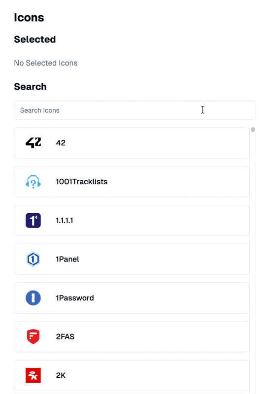

## 아쉬운 점

정말 딱 한가지 아쉬운 점이 있었는데, 바로 그리드 레이아웃을 포기했던 부분입니다.
기존 아이콘 목록은 화면 너비에 따라 `column` 수가 변하는 반응형 그리드 레이아웃이었는데,
목록 가상화를 진행하면서 모든 요소들이 계산된 위치로 `absolute`하게 위치되다보니 반응형을 처리하기가 매우 까다로웠어요.

TanStack Virtual이 그리드 레이아웃을 지원하긴 하지만 반응형까지 지원하지는 않아서 직접 구현해야했는데,
별도로 `window size`를 계산하고 요소를 재배치하는 로직까지 고민하기에는 시간이 충분하지 못했던 것 같습니다.

다음에 여유가 된다면, 목록 가상화에 대해서 더 깊게 알아보고 직접 구현해보기도 하고, 반응형 그리드를 고민해서 라이브러리로 만들어보고 싶네요!
혼자 개발을 진행하면서 이 정도로 눈에 띄는 성능 개선을 해볼 수 있는 기회가 얼마나 있을까 싶은데, 운이 좋았던 것 같습니다.

긴 글 읽어주셔서 감사합니다!
